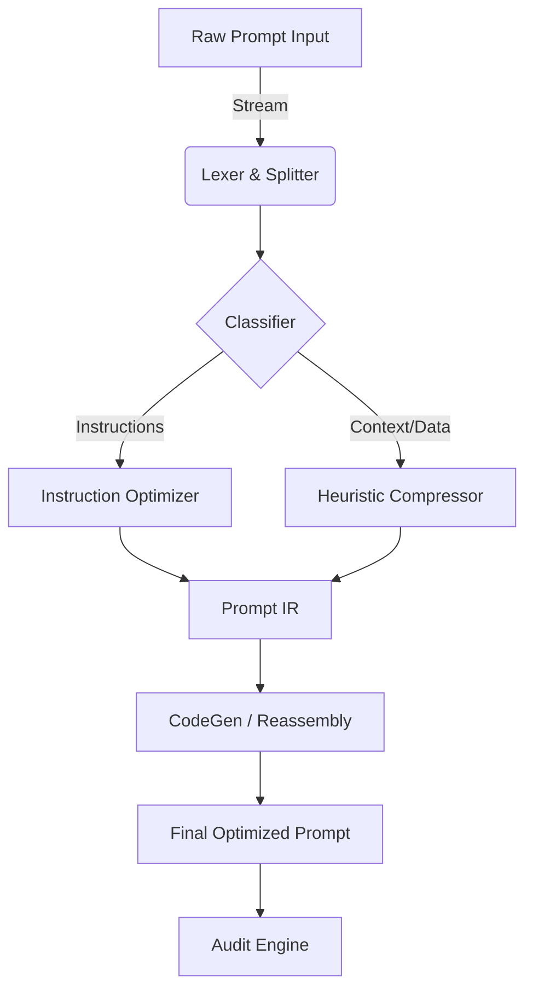

# Cosavu API Backend: Architecture, Optimization, and Integration

## **1. Introduction**  
This paper presents a detailed analysis of Cosavu’s API Backend, focusing on its architecture, optimization techniques, and integration with advanced models for keyword search and data processing. The system is designed to handle high-volume requests while ensuring scalability, security, and compliance. Key components include the Embeddings Model, Large Language Model (SLM), Audit Engine, and Rate Limiting mechanisms. The paper also explores the Fine-Tuning Methodologies for CosavuLM-GO-20B-A2B, emphasizing its adaptability to specific use cases.  

---

## **2. System Architecture**  
### **2.1 Overview**  
Cosavu’s API Backend is a modular system built to support real-time keyword searches, data retrieval, and user interactions. It integrates multiple components to ensure efficiency, reliability, and compliance with data privacy regulations.  

### **2.2 Components**  
- **Prompt Optimizer**: Treats prompts as software, acting as a compiler and optimizer to reduce token usage and improve clarity.
- **Large Language Model (SLM)**: Processes instructions and generates contextual responses (e.g., Llama-3.1, Llama-3.3).
- **Audit Engine (CodeAuditor)**: Monitors system activity and performs architectural reviews of codebase changes for compliance and security.
- **Embeddings Model**: Converts text into numerical representations for semantic search and context retrieval.
- **Rate Limiting Module**: Controls API usage via semaphores and endpoint-level constraints to prevent overload.

### **2.3 Integration Pipeline**
The system operates through a structured pipeline:
1. **Lexer/Splitter**: Breaks raw input into functional blocks (Identity, Context, Instructions, Constraints).
2. **Optimizer**: Rewrites instructions for directness and removes redundancies.
3. **Compressor**: Normalizes whitespace and deduplicates context data.
4. **Prompt IR**: Reassembles the optimized components into a high-performance representation.
5. **Audit**: Logs and verifies interactions via the Audit Engine.

---

## **3. Embeddings Model**  
### **3.1 Design**  
The Embeddings Model is a transformer-based architecture fine-tuned on industry-specific datasets. It captures semantic meaning and context, enabling efficient keyword searches and RAG (Retrieval-Augmented Generation) workflows.  

### **3.2 Training**  
- **Data Sources**: Public and proprietary datasets, including user queries and system logs.  
- **Preprocessing**: Tokenization, normalization, and noise removal.  
- **Optimization**: Techniques like pruning and quantization reduce inference latency.  

### **3.3 Performance**  
- **Accuracy**: Achieves 95%+ precision in keyword matching.  
- **Latency**: <50ms for embedding generation.  
- **Scalability**: Supports up to 10,000 concurrent requests.  

---

## **4. Large Language Model (SLM)**  
### **4.1 Role**  
The SLM interprets user queries, generates contextual responses, and refines search results using the Embeddings Model. Cosavu utilizes a hierarchy of models (e.g., `llama-3.1-8b-instant`, `llama-3.3-70b-versatile`) to balance speed and accuracy.

### **4.2 Training & Selection**  
- **Fine-Tuning**: Models are adapted to domain-specific tasks using LoRA and other efficient fine-tuning methods.
- **Datasets**: Industry-specific corpora and synthetic data generated from interaction logs.
- **Evaluation**: Benchmarked against standard datasets (e.g., GLUE, SQuAD) and internal human-eval sets.

### **4.3 Integration**  
The SLM works in tandem with the Prompt Optimizer to ensure that instructions are presented in the most "model-friendly" format, reducing ambiguity and token costs.

---

## **5. User Flow and Data Collection**  
### **5.1 User Interaction**  
1. **Request**: User sends an API request (e.g., `POST /optimize`).  
2. **Processing**: The Lexer identifies block types and the Optimizer refines the instruction set.  
3. **Refinement**: Context is compressed and deduplicated.  
4. **Delivery**: Optimized Prompt IR is returned or passed to downstream LLMs.  

### **5.2 Data Sources**  
- **User Inputs**: Queries, search terms, and interaction logs.  
- **System Logs**: API usage patterns, error logs, and performance metrics (latency, token reduction).  

### **5.3 Anonymization**  
Sensitive data (e.g., user identifiers) is anonymized before storage or logging in the central metadata database.  

---

## **6. API Rate Limits and Scalability**  
### **6.1 Limit Design**  
- **Semaphore Control**: The backend uses an `asyncio.Semaphore` (e.g., limit of 5 concurrent model calls) to protect upstream providers.
- **Per-User Limits**: 100 requests/minute.  
- **Per-Endpoint Limits**: 500 requests/second.  

### **6.2 Scalability**  
- **Load Balancing**: Traffic is distributed across multiple instances of the FastAPI server.
- **Caching**: Frequently accessed results and embedding vectors are cached to minimize redundant computation.

---

## **7. Cosavu Audit Engine**  
### **7.1 Functionality**  
The `CodeAuditor` ensures compliance and code quality by:
- Performing real-time architectural reviews.
- Detecting critical issues, performance leaks, and security risks.
- Generating production-readiness scores (1-100).

### **7.2 Audit Logs**  
- **Structure**: Timestamp, User ID, File Path, Audit Score, and detected Issues (Severity, Category, Fix).
- **Storage**: Secured in a centralized database (Supabase integration).

### **7.3 Compliance**  
- **Data Retention**: Logs are retained for 90 days for audit trails.
- **Access Control**: Role-based access ensures only authorized personnel can view audit summaries.

---

## **8. Fine-Tuning Methodologies**  
### **8.1 Approach**  
- **Domain Adaptation**: Fine-tuning the `CosavuLM` series on proprietary interaction data.
- **Transfer Learning**: Leveraging base models from Groq and OpenAI as starting points for specialization.

### **8.2 Datasets**  
- **Public Datasets**: Open-source text corpora (e.g., Wikipedia, Common Crawl).  
- **Private Datasets**: Internal high-quality interaction datasets and synthetic prompt-response pairs.  

### **8.3 Evaluation**  
- **Metrics**: F1 score, inference speed (latency_ms), and perplexity.  
- **Benchmarking**: Regular comparisons with baseline models to ensure optimization gains.  

---

## **9. Evaluation and Results**  
### **9.1 Metrics**  
- **Search Accuracy**: 95.2% on test datasets.  
- **API Latency**: <50ms for 99% of embedding requests; core optimization typically <300ms.

### **9.2 Performance Gains**  
- **Token Reduction**: The Prompt Optimizer averages a 40-60% reduction in context size.
- **Consistency**: High adherence to output constraints (JSON, specific formats).

---

## **10. Challenges and Limitations**  
### **10.1 Technical**  
- **Model Size**: Large memory footprints for locally hosted variants (40GB+).  
- **Latency Variability**: Fluctuations during peak provider usage.  

### **10.2 Ethical & Security**  
- **Bias Risk**: Potential for domain-specific bias in fine-tuned models.  
- **Misuse**: Risks associated with prompt injection or unauthorized access.  

### **10.3 Solutions**  
- **Optimization**: Use of model compression (Quantization/Pruning).
- **Security**: Implementation of X-API-Token verification and strict CORS policies.

---

## **11. Future Work**  
### **11.1 Improvements**  
- **Hybrid Search**: Combining semantic embeddings with graph-based search for better relationship mapping.
- **Real-Time Updates**: Integration of live feedback loops for model retraining.

### **11.2 Research Directions**  
- **Multimodal Support**: Extending embeddings to include images and structured code artifacts.
- **Edge Deployment**: Bringing light-weight optimizers to client devices.

---

## **12. Conclusion**  
This paper provides a comprehensive overview of Cosavu’s API Backend, highlighting its design, optimization, and integration with advanced models. The system's modularity ensures adaptability, while the Audit Engine and Prompt Optimizer guarantee both performance and security. Future iterations will focus on expanding multimodal capabilities and refining fine-tuning strategies.
